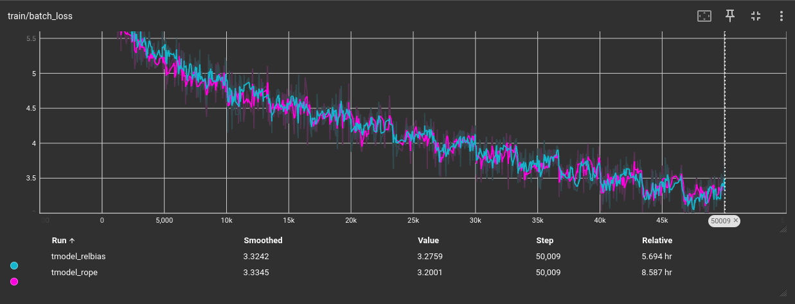
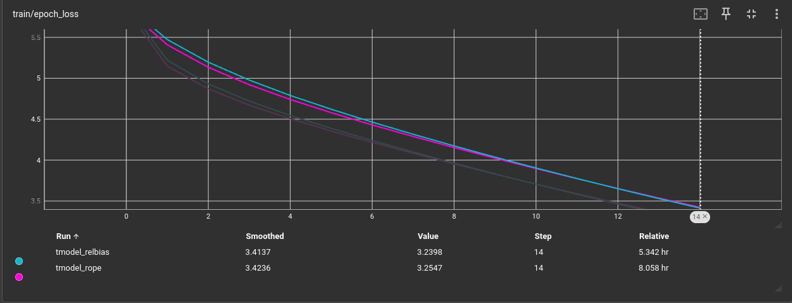
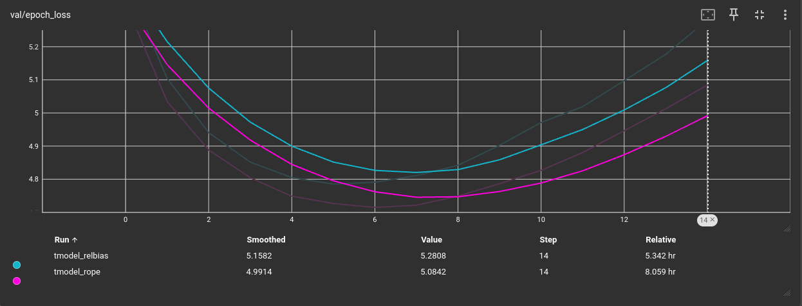

# REPORT

### LOSS

#### Training Loss Per Batch

#### Training Loss Per Epoch

#### Validation Loss Per Epoch

Short answer: **There’s no universal winner** — both can be faster depending on implementation, data, and hyperparameters.
But in practice:

# Why one might converge faster than the other

**Relative position bias (learned additive bias)**

* Adds a *small number of trainable parameters* (per head × relative distances).
* Model can immediately use these scalar biases to prefer close/favored positions — an easy signal to learn.
* Often reduces early training loss quickly (hence faster apparent convergence).

**RoPE (rotary embeddings)**

* Injects position information by rotating Q/K vectors — *no learned params*.
* The model must learn to exploit the rotated Q/K patterns in downstream layers; this can be slightly slower initially but can lead to better representations and extrapolation.
* Less risk of overfitting via learned bias table; may be more stable if implemented well.

---

# What actually controls convergence speed (practical factors)

1. **Implementation correctness** — small bugs in indexing/broadcasting for relative bias or incorrect RoPE application can slow/ruin learning.
2. **Initialization** — relative bias must be zero-initialized to avoid harming early training.
3. **Learning rates** — learned biases (relative-bias params) are scalars and sometimes need a different LR (often higher).
4. **Max distance (for relative bias)** — if too small you underrepresent needed offsets; if too large you add params but usually OK.
5. **Batch size / data distribution** — if dependencies are very local, relative bias helps faster; if patterns are more complex, RoPE might be better after more steps.
6. **Random seed / variance** — single-run differences can be noisy; average over seeds.
7. **Logging frequency / metric used** — train loss may drop faster for one method while BLEU lags (or vice versa).

---

### Translation Accuracy

#### BLEU SCORE

|             |Greedy|Beam|TOP-K|
|-------------|------|----|-----|
|**ROPE**         | 4.92 |4.61|3.08 |
|**RELATIVE BIAS**| 4.67 |4.78|3.18 |

---

## 🔹 Impact of Decoding Strategies on Translation Accuracy

### 1. **Greedy Decoding**

* **ROPE (4.92)** outperforms Relative Bias (4.67).
* Greedy decoding makes **locally optimal choices** without exploring alternatives.
* A higher BLEU here suggests that **RoPE’s positional encoding helps the model make better token-by-token predictions**, aligning local probabilities well with the reference translation.
* However, greedy decoding can miss better global sentence structures.

---

### 2. **Beam Search**

* **Relative Bias (4.78)** slightly outperforms RoPE (4.61).
* Beam search maintains multiple hypotheses, which requires the model to produce **coherent long-range structures**.
* The improvement for Relative Bias suggests that it **better captures relationships across longer contexts**, allowing beam search to exploit this structure and select better global translations.

---

### 3. **Top-K Sampling**

* Both perform poorly overall (ROPE: 3.08, RelBias: 3.18).
* Top-K introduces randomness, which can reduce BLEU if the model is not strong enough.
* Relative Bias still edges out RoPE slightly, meaning it provides **more flexibility** in generating plausible alternatives.
* But since BLEU rewards closeness to a single reference, sampling often hurts scores (even if outputs are fluent).

---

## 🔹 Overall Observations

1. **RoPE excels with Greedy decoding** → better local predictions, sharp token-level probabilities.
2. **Relative Bias excels with Beam & Top-K** → stronger global consistency, more robust under exploratory decoding.
3. **Top-K is not ideal for BLEU evaluation** since BLEU penalizes diverse outputs; it might still be useful for generating **more natural translations** in real-world use cases.
4. **BLEU scores are low overall (<5)** → both models need more training, better regularization, or larger datasets to achieve strong translation accuracy.

---

